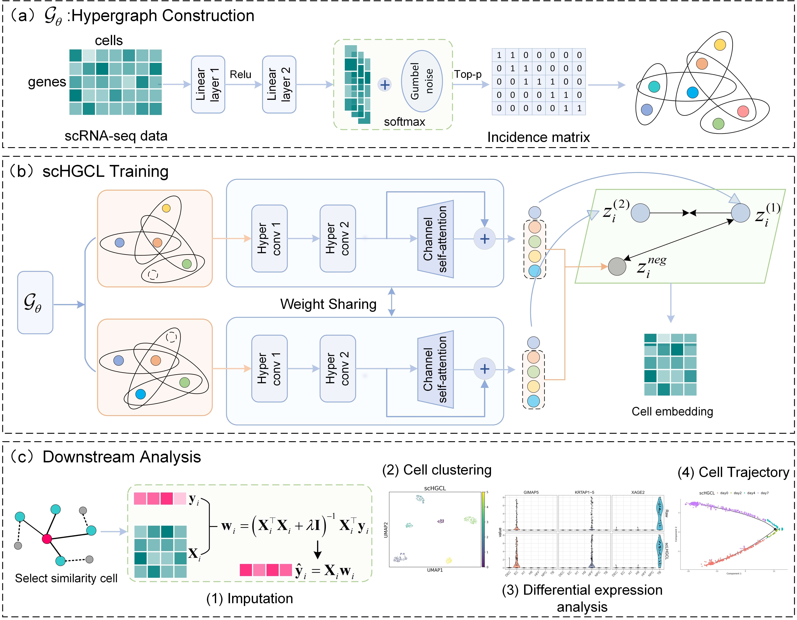

# scHGCL: Hypergraph-Based Contrastive Learning for Robust Gene Expression Recovery in scRNA-seq Data


<p align="center">
  
</p>


### Usage

Run the script：
```bash
python train.py --data_path data/counts.csv --drop_rate 0.55 --p 0.85 --tau 0.7 --epochs 200
```

### Arguments

| Argument       | Description                     | Default                       |
|----------------|---------------------------------|-------------------------------|
| `--use_gpu`    | Whether to use GPU (1 for CUDA, 0 for CPU) | `1`                           |
| `--data_path`  | Path to the input gene expression matrix | `counts.csv` |
| `--drop_rate`  | Dropout rate                    | `0.55`                        |
| `--p`          | Top-p threshold for hyperedge selection | `0.85`                        |
| `--tau`        | Gumbel-Softmax temperature parameter | `0.7`                         |
| `--epochs`     | Number of training epochs       | `200`                         |

---
